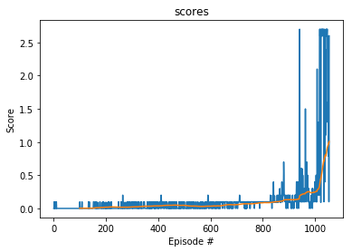

# Project 3: Collaboration and Competition

### Introduction

For this project, we will work with the [Tennis](https://github.com/Unity-Technologies/ml-agents/blob/master/docs/Learning-Environment-Examples.md#tennis) environment.

In this environment, two agents control rackets to bounce a ball over a net. If an agent hits the ball over the net, it receives a reward of +0.1.  If an agent lets a ball hit the ground or hits the ball out of bounds, it receives a reward of -0.01.  Thus, the goal of each agent is to keep the ball in play.

The observation space consists of 8 variables corresponding to the position and velocity of the ball and racket. Each agent receives its own, local observation.  Two continuous actions are available, corresponding to movement toward (or away from) the net, and jumping. 

The task is episodic, and in order to solve the environment, your agents must get an average score of +0.5 (over 100 consecutive episodes, after taking the maximum over both agents). Specifically,

- After each episode, we add up the rewards that each agent received (without discounting), to get a score for each agent. This yields 2 (potentially different) scores. We then take the maximum of these 2 scores.
- This yields a single **score** for each episode.

The environment is considered solved, when the average (over 100 episodes) of those **scores** is at least +0.5.

### Getting Started

1. Download the environment from one of the links below.  You need only select the environment that matches your operating system:
    - Linux: [click here](https://s3-us-west-1.amazonaws.com/udacity-drlnd/P3/Tennis/Tennis_Linux.zip)
    - Mac OSX: [click here](https://s3-us-west-1.amazonaws.com/udacity-drlnd/P3/Tennis/Tennis.app.zip)
    - Windows (32-bit): [click here](https://s3-us-west-1.amazonaws.com/udacity-drlnd/P3/Tennis/Tennis_Windows_x86.zip)
    - Windows (64-bit): [click here](https://s3-us-west-1.amazonaws.com/udacity-drlnd/P3/Tennis/Tennis_Windows_x86_64.zip)
    
    (_For Windows users_) Check out [this link](https://support.microsoft.com/en-us/help/827218/how-to-determine-whether-a-computer-is-running-a-32-bit-version-or-64) if you need help with determining if your computer is running a 32-bit version or 64-bit version of the Windows operating system.

    (_For AWS_) If you'd like to train the agent on AWS (and have not [enabled a virtual screen](https://github.com/Unity-Technologies/ml-agents/blob/master/docs/Training-on-Amazon-Web-Service.md)), then please use [this link](https://s3-us-west-1.amazonaws.com/udacity-drlnd/P3/Tennis/Tennis_Linux_NoVis.zip) to obtain the "headless" version of the environment.  You will **not** be able to watch the agent without enabling a virtual screen, but you will be able to train the agent.  (_To watch the agent, you should follow the instructions to [enable a virtual screen](https://github.com/Unity-Technologies/ml-agents/blob/master/docs/Training-on-Amazon-Web-Service.md), and then download the environment for the **Linux** operating system above._)

2. Place the file in the DRLND GitHub repository, in the `p3_collab-compet/` folder, and unzip (or decompress) the file. 

### Instructions

Follow the instructions in `Tennis.ipynb` to get started with training the agent!  

### Learning algorithm

The algorithm used here is a Multi-Agents Deep Deterministic Policy Gradient (MADDPG), A MADDPG is composed of multiple DDPG agents. The details of MADDPG can be referred in [Ryan Lowe et al. “Multi-agent actor-critic for mixed cooperative-competitive environments”. In : Advances in Neural Information Processing Systems. 2017, p. 6379-6390.](https://arxiv.org/abs/1706.02275) 

During a step, the actors choose actions depending on their only observation. The critics however can use
the whole state information and the actions of the other agents in order to better evaluate the optimal action
value function. This allows to better estimate future rewards as the critic learns to approximate the other agents’ strategies.

The architecture of the networks are as follow: 

The actor is composed of 3 fc units :
- First layer : input size = 24 and output size = 256
- Second layer : input size = 256 and output size = 128
- Third layer : input size = 128 and output size = 4

The critic is composed of 3 fc units :
- First layer : input size = 48 and output size = 256
- Second layer : input size = 260 and output size = 128
- Third layer : input size = 128 and output size = 1

In the critic network, the second layer takes as input the output of the first layer concatenated with the choosen actions.

The training hyperparameters are as follow :
- Buffer size : 100,000
- Batch size : 256
- GAMMA : 0.99
- TAU : 0.001
- learning rate actor : 0.0001
- learning rate critic : 0.0001
- weight decay : 0
- noise decay : 0.99

### Plot of rewards

In the given training result, a reward score 1.0 (over 100 consecutive episodes, after taking the maximum over both agents) is used to assume the environment is sloved. We have solved this environment in 955 episodes. The plot of rewards is included here:

### Ideas of future works

A promising method that might be helpful and can improve the performance is AlphaZero: [David Silver et al. “Mastering chess and shogi by self-play with a general reinforcement learning algorithm”](https://arxiv.org/abs/1712.01815)